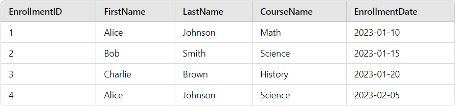

# Exercise: Creating and Using Foreign Keys in SQL

**Objective:** Create a table called `Enrollments` that will reference the existing `Students` table using a foreign key relationship. This will allow you to track student enrollments in different courses.

## Instructions

### Create the Enrollments Table with a Foreign Key

Create a table called `Enrollments` with the following columns:
- `EnrollmentID` (Primary Key)
- `StudentID` (Foreign Key referencing `Students.StudentID`)
- `CourseName`
- `EnrollmentDate`

### Insert Data into the Enrollments Table
Insert the following records into the Enrollments table:

- `(1, 1, 'Math', '2023-01-10')`
- `(2, 2, 'Science', '2023-01-15')`
- `(3, 3, 'History', '2023-01-20')`
- `(4, 1, 'Science', '2023-02-05')`

### Expected Result

### Notions

 - [sql.sh/cours/jointures] (https://sql.sh/cours/jointures)