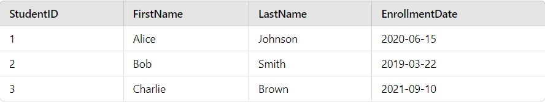

# Exercise: Creating and Using Primary Keys in SQL

## Instructions

### Create a Table with a Primary Key
Create a table called `Students` with the following columns:
- `StudentID` (Primary Key)
- `FirstName`
- `LastName`
- `EnrollmentDate`

### Insert Data into the Table
Insert the following records into the `Students` table:

- `(1, 'Alice', 'Johnson', '2020-06-15')`
-  `(2, 'Bob', 'Smith', '2019-03-22')`
- `(3, 'Charlie', 'Brown', '2021-09-10')`

### Expected Result

### Notions
- [sql.sh/cours/primary_key] (https://sql.sh/cours/create-table/primary-key)